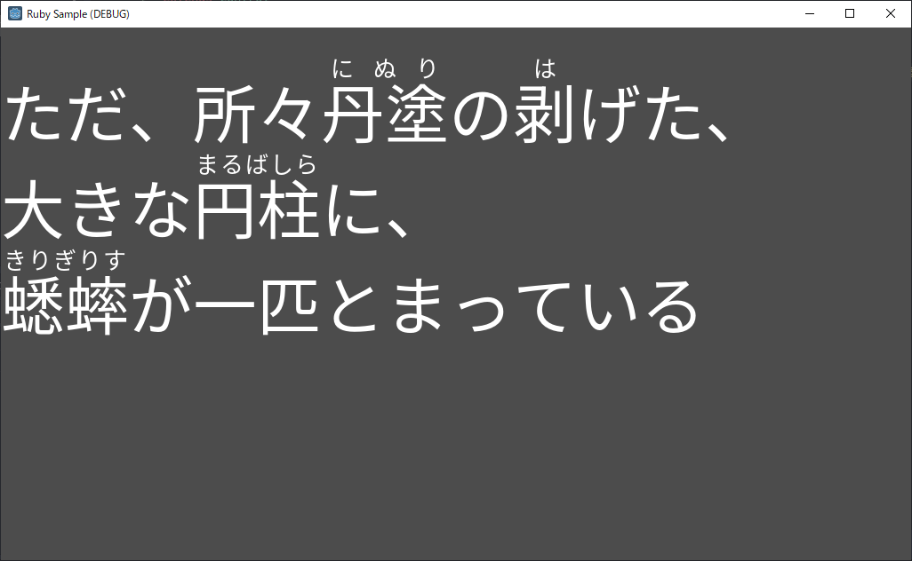
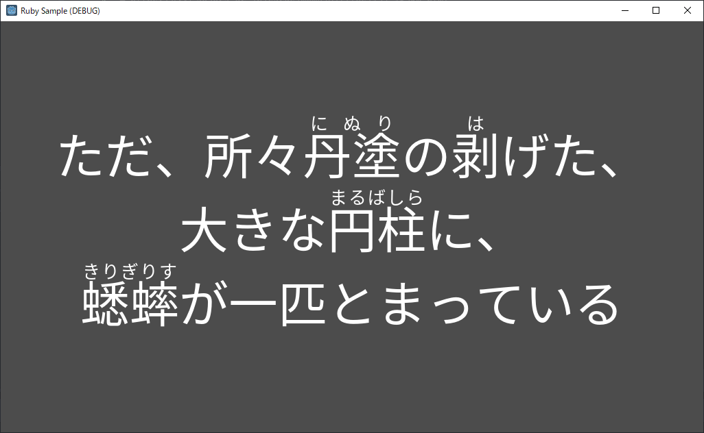
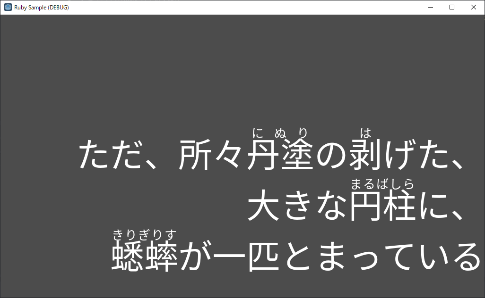
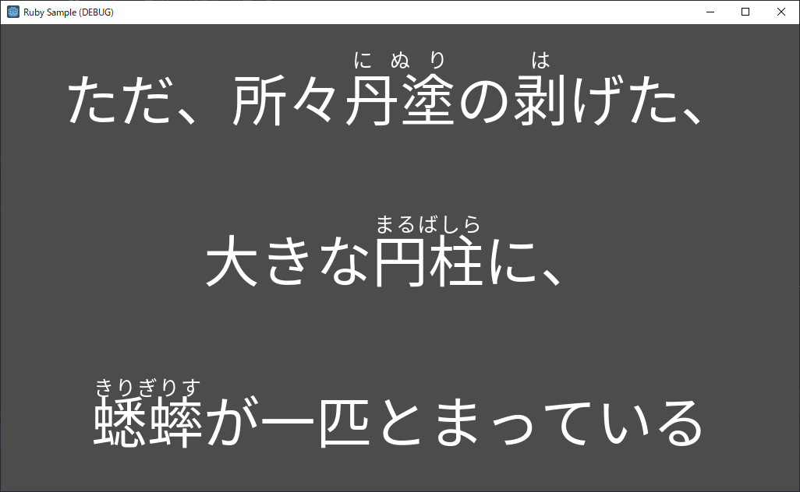

# Furigana (ruby) demo for Godot

## Description
- This is demo project that implements furigana (ruby) feature on Godot Engine.
- これは、Godot Engine上でフリガナ（ルビ）機能を実装したデモプロジェクトです。

## Font
- This demo project uses Noto Sans JP font (Licensed under OFL : [https://fonts.google.com/specimen/Noto+Sans+JP#license]([https://fonts.google.com/specimen/Noto+Sans+JP#license)).
- このデモプロジェクトではNoto Sans JPフォントを利用しています（OFLでライセンスされています。詳細は [https://fonts.google.com/specimen/Noto+Sans+JP#license]([https://fonts.google.com/specimen/Noto+Sans+JP#license) を参照してください）。

## Tested version
- Godot Engine 3.2.3

## Screenshot
- `"ただ、所々%ruby{丹塗,にぬり}の%ruby{剥,は}げた、\n大きな%ruby{円柱,まるばしら}に、\n%ruby{蟋蟀,きりぎりす}が一匹とまっている"` will be transformed into like this:

##### Left-Top

##### Center-Center

##### Right-Bottom

##### Center-Fill

## License
CC0 (Public Domain)
